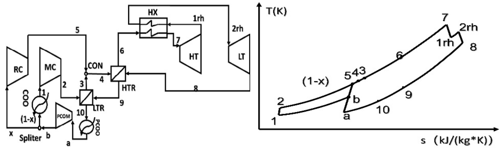

As one popular supercritical CO2 (sCO2) power cycle, the recompression cycle has attracted various modifications. However, comparative studies are still required to determine whether these modifications are necessary. In this paper, three modifications on the original recompression cycle (I) are compared, which are reheating cycle (II), partial cooling cycle (III), and reheated partial cooling cycle (IV). Thermodynamic states are calculated based on the recuperator effectiveness, and the split ratio, reheating pressure and pre-cooling pressure are calculated by genetic algorithm (GA). The thermal efficiencies are calculated as 40.01%, 40.44%, 39.88%, and 41.63%. The exergy efficiencies are 55.49%, 56.07%, 55.27% and 57.69%. It reveals that only reheated partial cooling cycle improves the performance, neither reheating cycle nor partial cooling cycle. This conclusion is not limited to specific parameters as the parametric study indicates. One explanation from the exergy analysis is that the reheated partial cooling cycle combines the edges of both reheating and partial cooling modifications.
