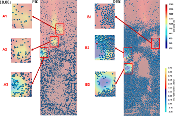

This paper compares the two Eulerian-Lagrangian methods, computational fluid dynamics–discrete element method (CFD-DEM) and multiphase particle-in-cell (MPPIC), in simulating the biomass gasification in the fluidized bed. A series of reactions, including the drying, pyrolysis, and homogeneous and heterogeneous reactions, are implemented. The composition of the product gases is predicted and the trajectories, diameters, heat transfers, and temperatures of the discrete particles are compared. The effects of steam-to-biomass ratio and reactor temperature are explored. The results show that the difference between the MPPIC and the CFD-DEM in predicting the H2 share is no more than 0.26%, while the errors between the simulation and the experiment are 0.45% (CFD-DEM) and 0.71% (MPPIC), respectively. Besides, both the CFD-DEM and MPPIC show the same trend when changing the operating parameters. Therefore, we think, although there are discrepancies between MPPIC and DEM in particle-scale details, for the reactor-scale applications, e.g., predicting the composition of the product gas, the MPPIC is adequately accurate as DEM.
