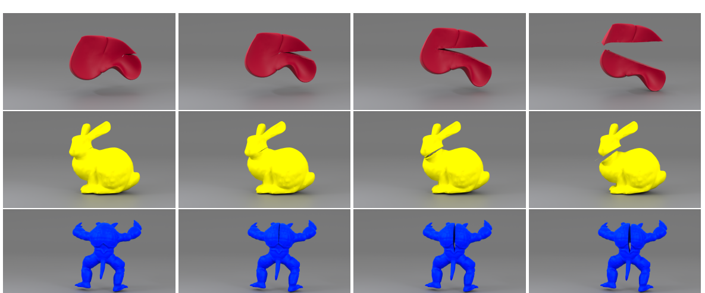

Real-time simulation of cutting is essential to fields requiring accurate interactions with digital assets, such as virtual manufacturing or surgical training. This paper introduces optimizations for both parallel constraint solving and convergence acceleration for cutting simulations within the XPBD framework: a ShortCut Graph Coloring (SCGC) algorithm that rapidly re-partitions and re-colors the constraint graph after topology changes, keeping same-colored constraints solvable in parallel on the GPU throughout continuous cutting. The integrated approach of dynamic graph coloring, constraint clustering, and robust cutting demonstrates superior performance over existing parallel XPBD implementations, providing an efficient solver for soft-body cutting applications.
