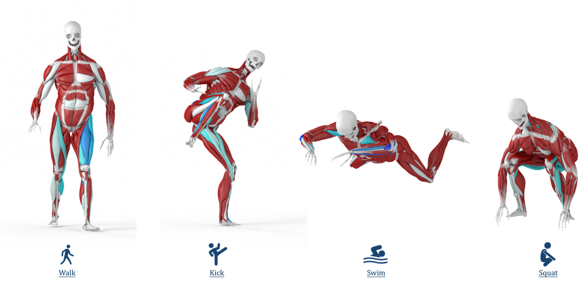

Body deformation caused by muscle contraction and extension plays a vital role in visual realism in games and movies, yet in most 3D animation pipelines artists have to manually specify the muscle activation, which is time-consuming and lacks physical realism. To address this, we build a system in which an RL-based controller, trained on a 1D Hill-type surrogate, discovers per-muscle activations that track reference motions without manual tuning; the same Hill-type constitutive law then drives a 3D volumetric simulator to produce realistic muscle deformation. To achieve stable, efficient, and realistic simulation, we solve Extended Position-Based Dynamics (XPBD) within a Geometric Multigrid (GMG) scheme built on cascaded cages with barycentric-coordinate prolongation. Within this GPU-parallelized solver, we inject the same Hill-type force-length law as an energy-based fiber constraint that turns per-fiber activation into realistic muscle contraction and bulging. We demonstrate volumetric muscle simulation on a 194-muscle human body with a diverse set of motions (walk, kick, swim, overhead-squat, etc.), simulating the full-body model at 18 ms per frame on a single RTX 4090.
