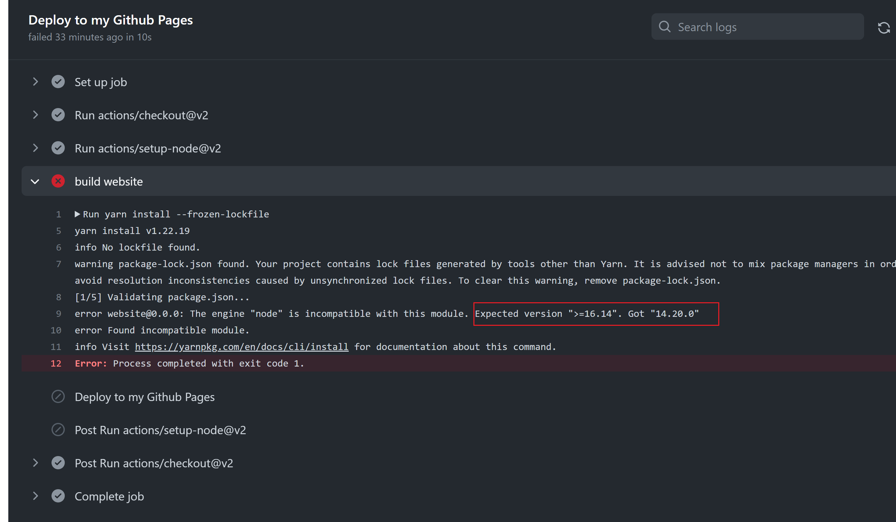

前文说了如何部署，但是每次都要运行yarn deploy也太麻烦了。主要是如果你想在一台没有安装docusaurus的电脑上更新你的博客，那就没办法了。只能配环境然后yarn deploy。

但是好在有许多自动化部署的工具。其中GitHub Action是github自己在2018年推出的服务。你只需要在项目的根目录下增加.github/workflow/xxx.yml即可

如图所示


每个文件都是单独的一个工作流。

工作流也很简单，就是类似于你在自己的电脑上运行安装等等命令。

假如你的workflow中间出问题了，github就会自动报错，然后给你发个邮件。如图


不成功的workflow是这样的


点开会看到


再点开，会看到具体哪里错了

我这里显然是版本号错误

修改之后可以看到正确的


经过不断的探索，我终于把所有的工作流报错解决了

在此分享一下我的deploy.yml文件
```
# .github/workflows/deploy.yml

name: GitHub Pages

on:
  push:
    branches:
      - master
  pull_request:

jobs:
  deploy:
    name: Deploy to my Github Pages
    runs-on: ubuntu-latest
    steps:
      - uses: actions/checkout@v2
      - uses: actions/setup-node@v2
        with:
          node-version: '18'
          cache: yarn
          cache-dependency-path: './package-lock.json'

      - name: build website
        run: |
          yarn install --frozen-lockfile
          yarn build

      - name: Deploy to my Github Pages
        uses: peaceiris/actions-gh-pages@v3
        with:
          github_token: ${{ secrets.GITHUB_TOKEN }}
          publish_dir: ./build
          user_name: github-actions[bot]
          user_email: 41898282+github-actions[bot]@users.noreply.github.com

```