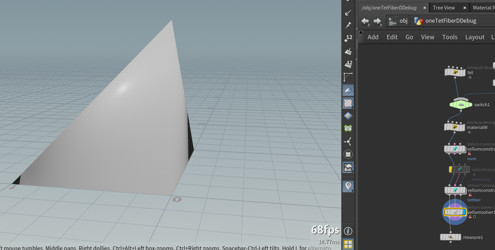

# Houdini Debug Vellum

## Case设置



其中两个aw分别为

```c

int p0 = addpoint(0, {0,0,0});
int p1 = addpoint(0, {1,0,0});
int p2 = addpoint(0, {0,1,0});
int p3 = addpoint(0, {0,0,1});

// 注意：交换 1 和 2
addprim(0, "tet", p0, p2, p1, p3);
```

```c
v@materialW={0,1,0};
```

第一个vellum constraint只是设置密度为1000

第二个vellum constraint设置tet fiber，stiffness为1000

在节点上右键然后点击Allow Editing of Content后进入节点


<aside>
📎

如果期间发生BUG并导致Houdini崩溃。可以先把节点保存为HDA。

右键Digital Asset →Save Copy As (或者如果你已经保存过一次了，那么Increase Minor Version来避免冲突）


勾选Add Author to Namespace 并设置Save To 为Embeded。这样不会影响其他HDA并且每次打开该文件都可以自动应用，不会出现错误。


</aside>

## Constraint的创建（Vex）

进入vellum constraint节点并找到add_tetfiber_constraints这个wrangle。发现引用了pbd_constraints.h的createTetFiberConstraint函数。


这个函数位于C:\Program Files\Side Effects Software\Houdini 21.0.440\houdini\vex\include\pbd_constraints.h


## Constraint Update（OpenCL Debug）

依次进入vellumsolver（SOP）→dopnet1→vellumsolver1（DOP） 最终找到constraint_update_cl20节点


copy一份constraint_update_cl20节点，并将kernel file参数改为pbd_constraints2.cl


找到C:\Program Files\Side Effects Software\Houdini 21.0.440\houdini\ocl\sim\pbd_constraints.cl， 并copy一份，改名为pbd_constraints2.cl

在其中进行一些修改，例如增加语句L[idx*3+1]=100;

<aside>
📎

Windows写入需要管理员权限，可以在所修改的目录右键属性→安全→编辑 增加写入权限


</aside>

勾选recompile kernel然后运行一帧。就会发现L的第二个分量确实修改了。


## OpenCL 增加debug变量

1）利用create_debugmat创建了一个mat3来存储debug变量。
2）在Bindings中增加debugmat参数。注意要Binding到ConstraintGeometry

3）在pbd_constraints2.cl的constraintUpdate核函数当中增加debugmat参数。
4）每次修改.cl文件后，勾选Recompile Kernel来重新编译kernel。


## OpenCL的教程

Houdini官方有一套OpenCL for Vex Users教程，从他的tutorials可以搜到。配有案例文件。

[Opencl SOP for VEX users | SideFX](https://www.sidefx.com/tutorials/opencl-sop-for-vex-users/)
