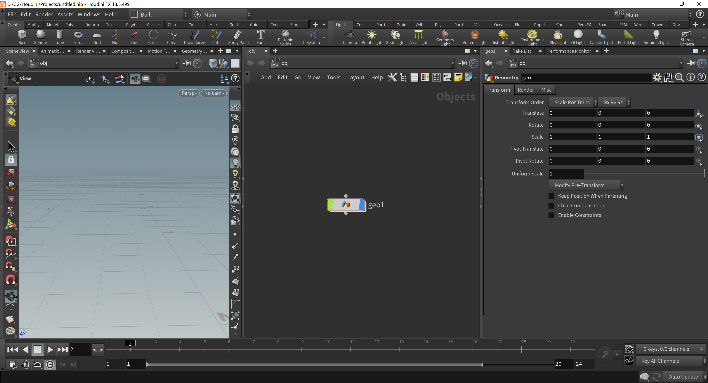
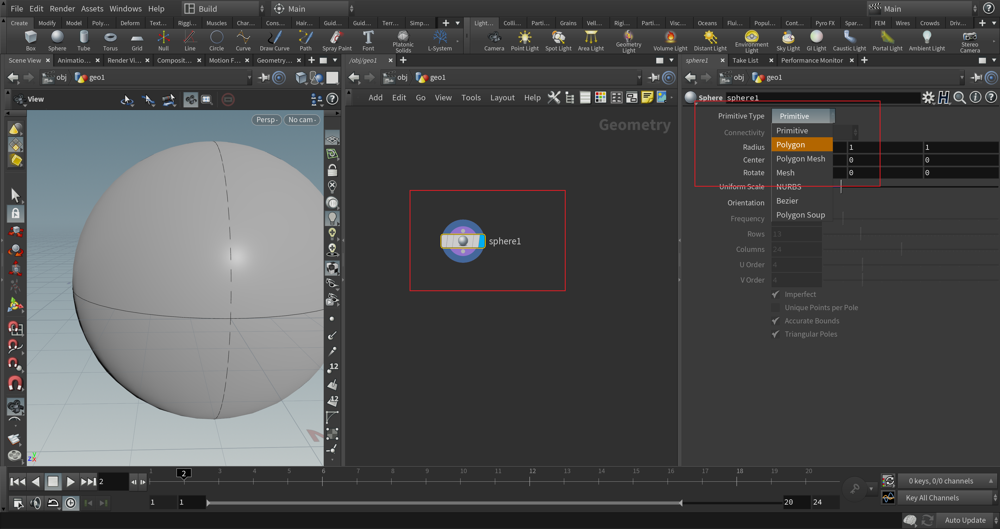
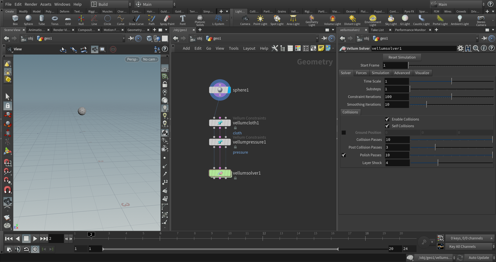
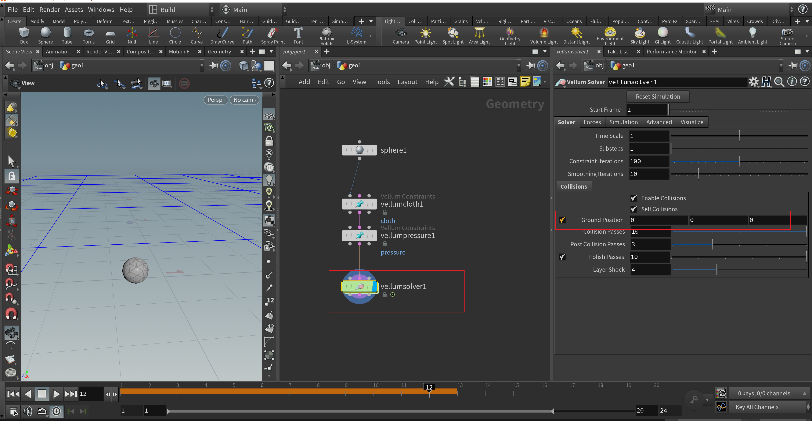

# 用Houdini 创建第一个软体模拟
Houdni之中的vellum是利用PBD来进行仿真的工具包。可以仿真布料、流体、软体、头发等。我们首先介绍最简单的软体仿真。

## step1: 创建一个geo节点，并进入geo节点
创建节点

然后双击进入geo

## step2: 创建一个球体，然后改变其primitive type 为polygon

将其大小改小0.1倍，然后向上平移0.5

## step3: 创建vellum configure ballon和 vellum solver

创建config ballon(这是houdini预先配置好的设置，相当于一个example)

然后创建vellum solver并将其连接

注意把sphere也连接好。最后节点如图

## step4: 为solver设置地板碰撞

## play
点击左下角的play

注意点击Real time toggle, 否则会按照模拟速度来运行，这就会太快，看起来不方便。

## 最终效果
可以看到软体

