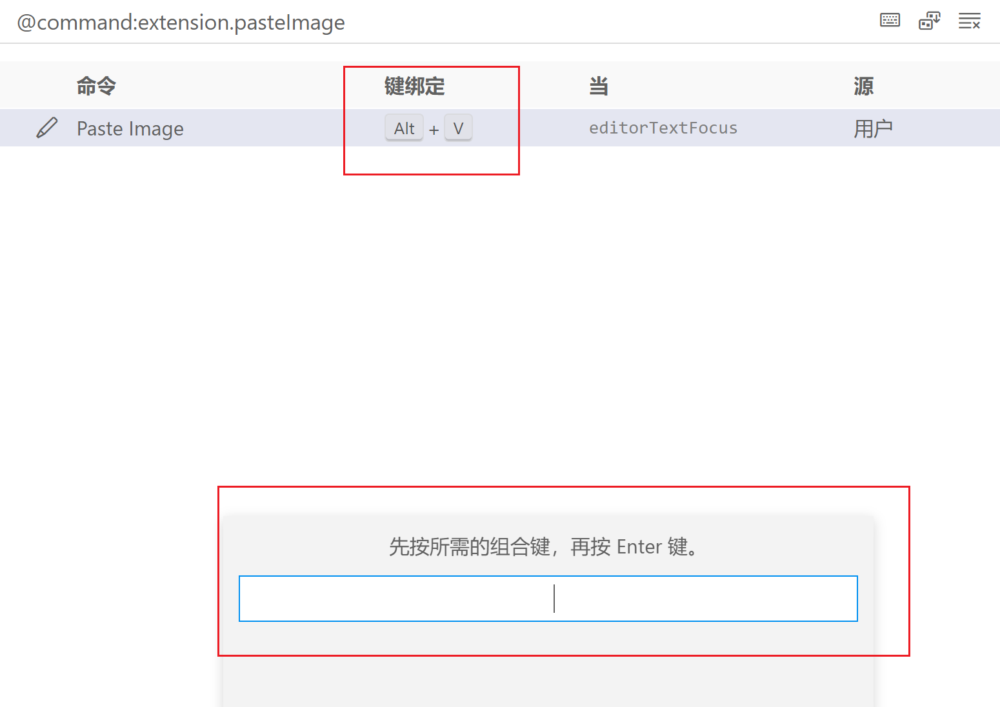

有个插件很好用，叫做paste image

这个插件让你在VS Code当中可以直接粘贴剪切板中的图片，它还会将图片自动拷贝到你的当前目录。简直是效率神器！

# 用法

先截屏，然后在VS Code中按下shift + control + p, 然后点击pasteImage

你还可以设置快捷键
比如我设置的快捷键就是alt+v(防止和文本的粘贴混淆)
设置的方法很简单，只需要点击小齿轮

然后在弹出的窗口设置快捷键即可

