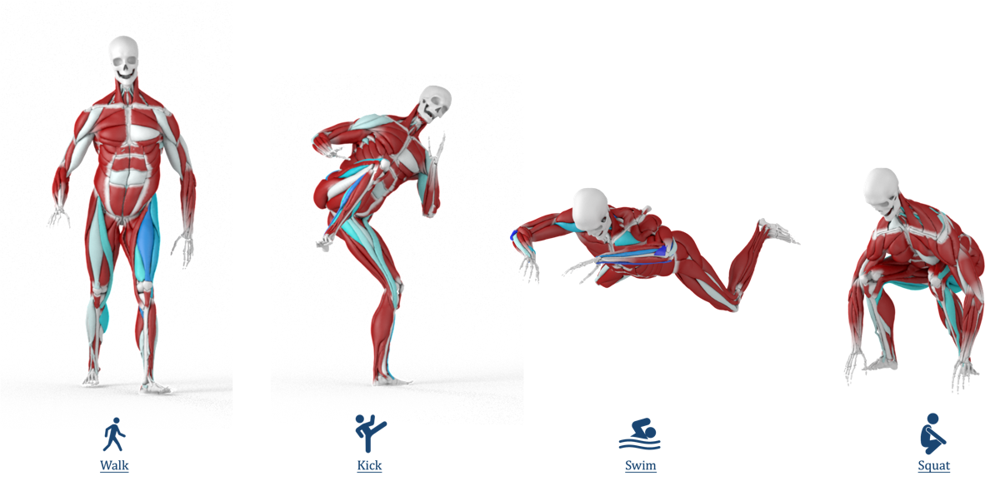
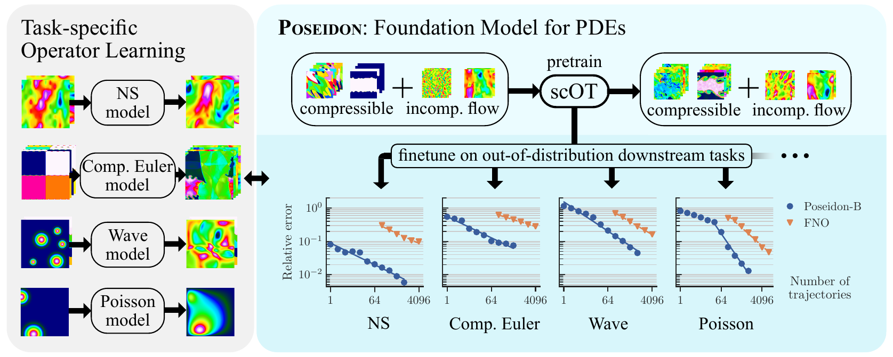
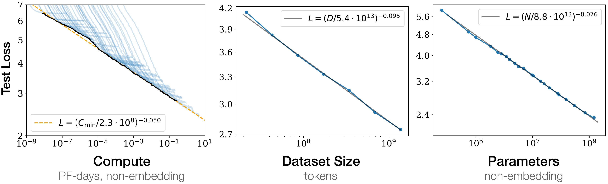
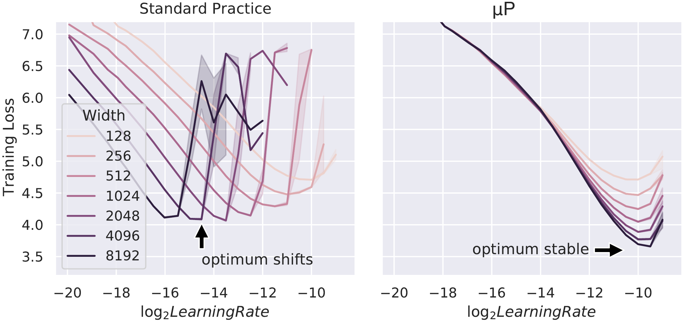

# Research Statement

**Chunlei Li**, Ph.D. Candidate, Beihang University; Visiting Ph.D. Student, University College London
Homepage: https://chunleili.github.io/ · Email: lichunlei1996@gmail.com · li_cl@foxmail.com
July 2026

> Content source for `research_statement.tex` → `research_statement.pdf`.
> The `.tex` file is what actually builds the PDF; keep both in sync when editing.
> Generic version: no lab-specific references, so it can be sent to any group. Add a tailored paragraph per application if useful.

## Overview

My long-term goal is to **bridge AI, physics, PDEs, and numerical methods**, and I see two themes on that bridge. The first is **AI for physics**. Many have explored it, most visibly the recent wave of physical foundation models, yet the results are not yet satisfying, least of all in **generalization and scalability**: most work merely accelerates existing methods on toy cases, and the field still awaits its **transformer moment**. The greatest potential of neural networks is not to replace what numerical methods already do well, but to offer what conventional pipelines cannot: generalizing across meshes, material parameters, and boundary conditions, spanning many phenomena with one method, and growing with parameters and data until networks **internalize physical laws**. The second theme is **physics for AI**, a direction just beginning to rise and full of potential: mechanics offers a language for understanding learning itself, with **dimensionless numbers**, like the Reynolds number, whose invariance across scale turns small models into "wind-tunnel experiments" for large ones; **boundary-layer-style reduced models** that peel just the right simplification off a complex phenomenon; and the **spectral analysis of iterative solvers** to explain the shape of scaling laws. My **distinctive advantage** is depth of experience on the physics side: years of work in simulation, numerical methods, PDEs, and mechanics let me see these connections, and judge which ones are load-bearing, in a way few coming from the learning side can.

## Past and Current Research

### Robust and scalable solvers for deformable dynamics

XPBD, the workhorse of interactive deformable simulation, stalls exactly where it matters most: high resolution and high stiffness. In **MGPBD** (SIGGRAPH 2025) I reformulated the constraint solve as a global optimization preconditioned by algebraic multigrid; it converges where XPBD diverges. The same line went into production at Alibaba as GPU muscle simulation in Houdini, and into a Pacific Graphics 2025 paper on **real-time soft-body cutting**.

### Unified constitutive modeling of complex materials

Materials such as mud, dough, and slime traverse fluid-like and solid-like regimes within one animation. In my **IEEE TVCG** paper I built a unified SPH solver whose constitutive model smoothly spans viscous, elastic, and plastic behavior.

### Simulation and learning in the loop

In **RLMuscle** (under review, IEEE TVCG) a reinforcement-learning controller trains on a cheap 1D surrogate, and the discovered activations drive a GPU multigrid-XPBD volumetric simulator, animating a 194-muscle body at 18 ms per frame.

## Future Research Directions

I see three concrete threads I could start on from day one, and two longer-term visions behind them, all serving the bridge above. The threads share one technical core: fast, robust simulation of coupled articulated and deformable systems under contact.

**1. Next-generation multilevel and Krylov solvers for volumetric deformable bodies.** Beyond MGPBD, two ideas: **nonlinear multigrid (FAS)**, where coarse levels solve the full nonlinear problem with a corrected right-hand side rather than a linearized error equation; and **Krylov subspace recycling**, which reuses approximate invariant subspaces across the slowly varying linear systems of successive time steps. Contact and friction are the demanding test bed: they bring nonlinearity, inequality constraints, and rapidly changing active sets, while still producing the temporally correlated systems that recycling can exploit.

**2. Contact and friction for robotics.** Contact is where simulation is least trustworthy and the bottleneck for robotics: accurate deformable contact is too slow for control loops, and non-smooth friction makes gradients unreliable, which is why sim-to-real transfer degrades on contact-rich manipulation. I want to couple my GPU solver to articulated rigid dynamics for **deformable-articulated contact**, study **well-behaved contact gradients**, and calibrate contact parameters from real interaction (**real2sim**), with biomimetic soft robots, such as robotic hands, as the application I find most compelling.

**3. The full muscle inverse problem: from video to activations.** I plan to invert RLMuscle: recover **activations from observation**, estimating what a real person's muscles are doing from ordinary video. Making the chain activations → deformation → skin → image differentiable makes gradient-based inference possible: an **ML deformer** as a fast differentiable surrogate, and **differentiable rendering** to close the loop against pixels. The problem remains severely underdetermined, so the real research is in the priors: anatomical structure, temporal regularization, and consistency with contact. A working version would give markerless, model-based estimates of internal muscle activity for biomechanics, rehabilitation, and sports science.

**Long-term vision I, AI for physics: models that learn physical knowledge.** The destination is not acceleration but **generalization and scalability**: models freed from expert setup, spanning many phenomena, improving with parameters and data until they internalize physical regularities. Neural operators and physical foundation models such as Poseidon (figure below) point this way, but the field is currently oversold: speedups are measured against **weak baselines**,[^weakbaselines] and demonstrations stay in **toy settings** that fail to generalize across boundary conditions and complex geometry. The productive path today is **hybrid**: learned components that assist existing methods rather than replace them. For example, in a multigrid solver a network can predict the near-kernel subspace from which the coarse space is built; a good prediction accelerates convergence, a bad one merely slows it, because the outer iteration still checks the residual and keeps **error control**.

**Long-term vision II, physics for AI: studying learning dynamics with the methods of physics.** Learning is a dynamical system, and its central puzzles are ones that PDE theory, fluid mechanics, and numerical analysis already have a language for. We may call this **scientific machine learning** or **physics-inspired machine learning**; a recent manifesto calls its core program "**learning mechanics**".[^learningmechanics] Two examples convey the flavor. The **dimensionless number**: as the Reynolds number predicts the transition from laminar to turbulent flow, one can imagine dimensionless groups of width, depth, data, and step size that predict the phase transitions of learning, from memorization to generalization, grokking, and emergence. μP-style hyperparameter transfer already delivers this payoff at the scale of language models. The **boundary layer**: Prandtl peeled off a simplified model faithful exactly where the difficulty lives, and the tractable limits of deep learning theory (NTK, mean-field) play the same role for training. **Edge-of-stability** training mirrors an explicit integrator's stability limit, and kernel spectra offer a route to **explaining scaling laws** rather than only fitting them.

[^weakbaselines]: A systematic review found 79% of fluid-PDE papers claiming to outperform a standard numerical method compared against a weak baseline. N. McGreivy and A. Hakim, "Weak baselines and reporting biases lead to overoptimism in machine learning for fluid-related partial differential equations," *Nature Machine Intelligence*, 2024. https://arxiv.org/abs/2407.07218

[^learningmechanics]: J. Simon, D. Kunin, A. Atanasov, B. Bordelon, J. Cohen, A. Jacot et al., "There Will Be a Scientific Theory of Deep Learning," 2026. https://arxiv.org/abs/2604.21691
